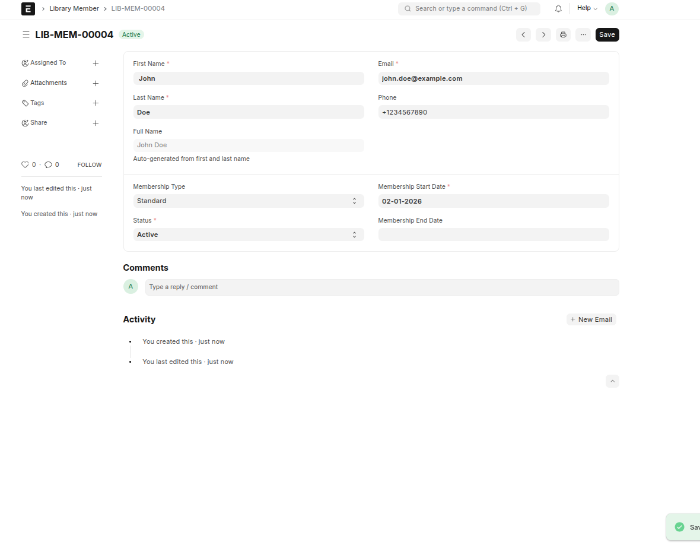

# Task 4: Testing Documentation

**Estimated Time**: 1 hour  
**Difficulty**: Easy

---

## Objective

Create comprehensive manual testing documentation for all the DocTypes you've created.

---

## Requirements

Create a file called `TESTING.md` in your app root directory:

```
apps/library_management/TESTING.md
```

---

## Test Documentation Format

Use this format for each test case:

```markdown
## Test Case: [Feature Name]

**Objective**: What you're testing

**Prerequisites**:
- List any setup required

**Steps**:
1. Step one
2. Step two
3. Step three

**Expected Result**:
- What should happen

**Actual Result**:
- What actually happened

**Status**: ✅ Pass / ❌ Fail

**Screenshot**: [filename or description]
```

---

## Required Test Cases

### Section 1: Library Member Tests

Document these test cases:

#### Test 1.1: Create New Member
- Create a member with all fields filled
- Verify member_id auto-generated
- Verify member appears in list


#### Test 1.2: Edit Member Details
- Open existing member
- Change membership_type
- Save and verify changes persist
 

#### Test 1.3: Email Uniqueness
- Try to create two members with same email
- Verify error message appears


#### Test 1.4: Member Status Change
- Change member status from Active to Inactive
- Verify status updates


#### Test 1.5: Delete Member
- Delete a test member
- Verify member removed from list


list view:

---
### Section 2: Book Tests

Document these test cases:

#### Test 2.1: Create New Book
- Create book with all fields
- Verify book_id auto-generated
- Verify available_copies equals total_copies


#### Test 2.2: Available Copies Auto-Set
- Create book with total_copies = 5
- Verify available_copies automatically set to 5


#### Test 2.3: Edit Total Copies
- Change total_copies from 5 to 3
- Verify available_copies updates accordingly


#### Test 2.4: Negative Copies Validation
- Try to set total_copies to -1
- Verify validation error appears


#### Test 2.5: ISBN Uniqueness
- Try to create two books with same ISBN
- Verify error message

---

### Section 3: Book Transaction Tests

Document these test cases:

#### Test 3.1: Create Issue Transaction
- Create transaction with type "Issue"
- Include due_date
- Verify transaction saves


#### Test 3.2: Issue Without Due Date
- Create Issue transaction without due_date
- Verify validation error
 

#### Test 3.3: Create Return Transaction
- Create transaction with type "Return"
- Include return_date
- Verify transaction saves


#### Test 3.4: Return Without Return Date
- Create Return transaction without return_date
- Verify validation error


#### Test 3.5: Invalid Return Date
- Set return_date before transaction_date
- Verify validation error

---

### Section 4: Integration Tests

Document these test cases:

#### Test 4.1: Complete Checkout Flow
- Create member

- Create book

- Issue book to member

- Verify all data correct - All test passed

#### Test 4.2: Link Field Functionality
- Verify Member link field shows member list
list view in member list : 
- Verify Book link field shows book list

- Verify selecting links populates correctly
Link feild 
---

## Example Test Case

Here's a complete example:

```markdown
## Test Case: Create New Library Member

**Objective**: Verify that a new library member can be created successfully with all required fields

**Prerequisites**:
- ERPNext is running
- Library Management app is installed
- User has permission to create Library Members

**Steps**:
1. Navigate to Library Management → Library Member
2. Click "New" button
3. Fill in the following fields:
   - First Name: "John"
   - Last Name: "Doe"
   - Email: "john.doe@example.com"
   - Phone: "+1234567890"
   - Membership Type: "Standard"
   - Membership Start Date: "2024-02-01"
   - Status: "Active"
4. Click "Save"

**Expected Result**:
- Member saves successfully
- member_id is auto-generated (e.g., LIB-MEM-00001)
- full_name is auto-populated as "John Doe"
- Member appears in Library Member list view
- Success message displayed

**Actual Result**:
- Member saved successfully
- member_id generated: LIB-MEM-00001
- full_name: "John Doe"
- Member visible in list view
- Message: "Library Member LIB-MEM-00001 saved"

**Status**: ✅ Pass

**Screenshot**: member_creation_success.png
```

---

## Deliverables

### TESTING.md File

Create the file with:

- [Done] All Section 1 tests (5 test cases)
- [Done] All Section 2 tests (5 test cases)
- [Done] All Section 3 tests (5 test cases)
- [Done] All Section 4 tests (2 test cases)
- [Done] **Total: 17 test cases minimum**

### Test Execution

- [yes] Execute all test cases
- [yes] Document actual results
- [yes] Mark each as Pass/Fail
- [yes] Take screenshots for key tests

---

## TESTING.md Template

Use this template to get started:

```markdown
# Library Management System - Testing Documentation

**Tester**: [Guduguntla Sathwik]  
**Date**: [08-030-2026]  
**ERPNext Version**: [V-15]  
**Environment**: [Ubuntu-lunix]

---

## Test Summary

| Category | Total Tests | Passed | Failed |
|----------|-------------|--------|--------|
| Library Member | 5 | X | X |
| Book | 5 | X | X |
| Book Transaction | 5 | X | X |
| Integration | 2 | X | X |
| **Total** | **17** | **X** | **X** |

---

## Section 1: Library Member Tests

### Test 1.1: Create New Member

[Use format shown above]

### Test 1.2: Edit Member Details

[Continue for all tests...]

---

## Section 2: Book Tests

[Document all book tests...]

---

## Section 3: Book Transaction Tests

[Document all transaction tests...]

---

## Section 4: Integration Tests

[Document integration tests...]

---
## Issues Found

1. During testing, some validations such as return date being earlier than the transaction date were not triggering properly in certain cases.
2. The available copies field sometimes did not update correctly when the total copies value was modified.
3. Certain fields like Due Date and Return Date were not always enforced based on the transaction type, which could allow incomplete data to be saved.

---

## Recommendations

1. Add stronger validation rules to ensure that date fields follow the correct order and required fields are filled based on the transaction type.
2. Improve the logic for updating available copies whenever total copies or transactions change.
3. Add clearer user feedback messages to guide users when incorrect data is entered.


## Acceptance Criteria

- ✅ TESTING.md file created
- ✅ All 17 test cases documented
- ✅ All tests executed
- ✅ Actual results recorded
- ✅ Pass/Fail status marked
- ✅ Test summary table completed
- ✅ Professional formatting
- ✅ Clear and detailed

---

## Tips

### Do's ✅

- Be specific in steps
- Include actual values used
- Note any unexpected behavior
- Take screenshots of errors
- Document workarounds if needed

### Don'ts ❌

- Don't skip test execution
- Don't leave results blank
- Don't use vague descriptions
- Don't ignore failures

---

## Common Issues

### Issue: Too many test cases to document

**Solution**: Focus on quality over quantity. The 17 required tests cover the essential functionality.

### Issue: Test fails but should pass

**Solution**: 
1. Document the failure
2. Investigate the cause
3. Fix if it's your code
4. Note if it's expected behavior

---

## Next Steps

After completing this task:

1. ✅ Review all 4 tasks completed
2. ✅ Ensure all screenshots taken (9 total)
3. ✅ Commit and push final changes:
   ```bash
   git add .
   git commit -m "docs(testing): add comprehensive test documentation"
   git push origin main
   ```
4. ✅ **Verify repository is public** on GitHub/GitLab
5. ✅ Create pull request using [PR Template](../../shared/templates/PR_TEMPLATE.md)
6. ✅ Complete [Self-Review](../../shared/templates/SELF_REVIEW.md)
7. ✅ Copy your **public repository URL**
8. ✅ Prepare submission package
9. ✅ Submit assignment!

---

**Congratulations on completing all tasks! 🎉**
